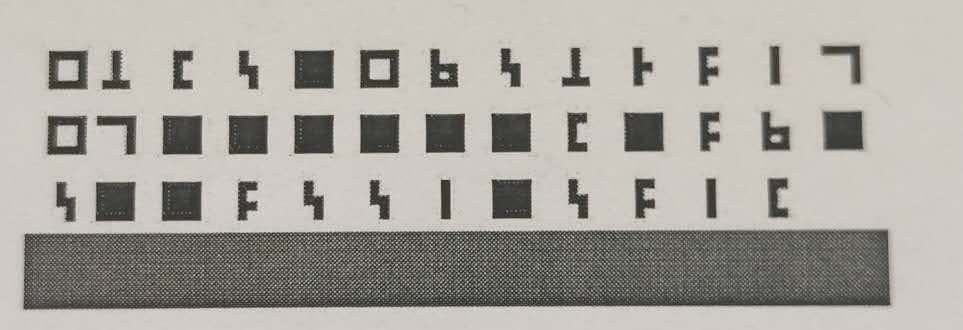
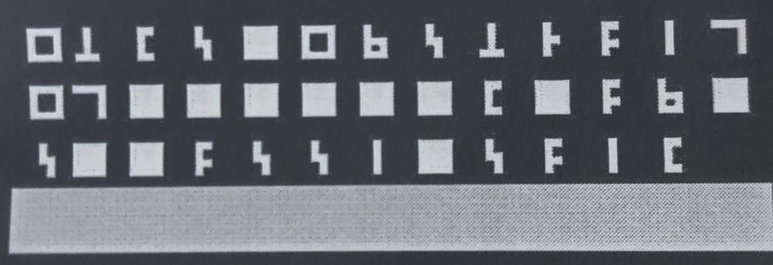
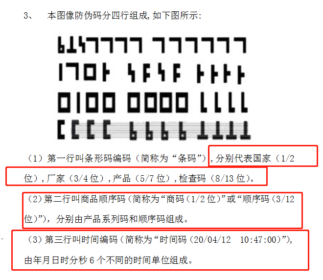
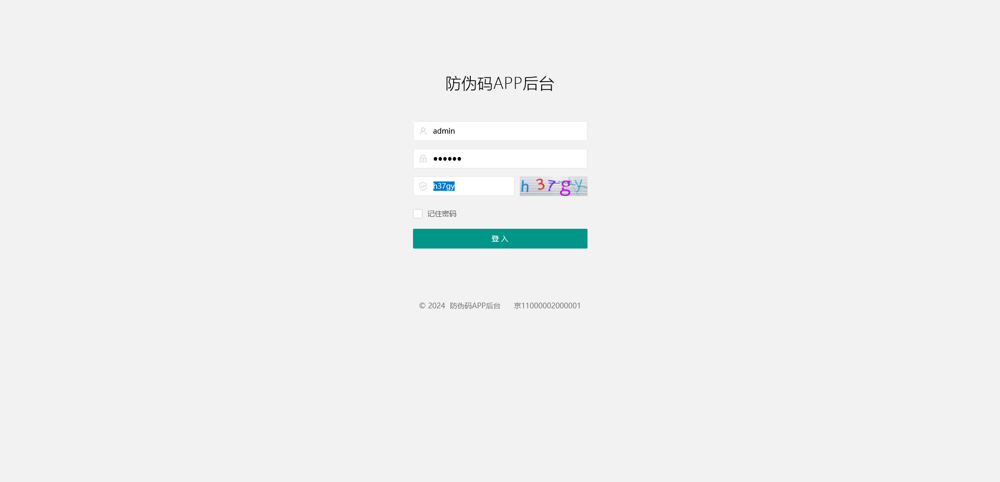
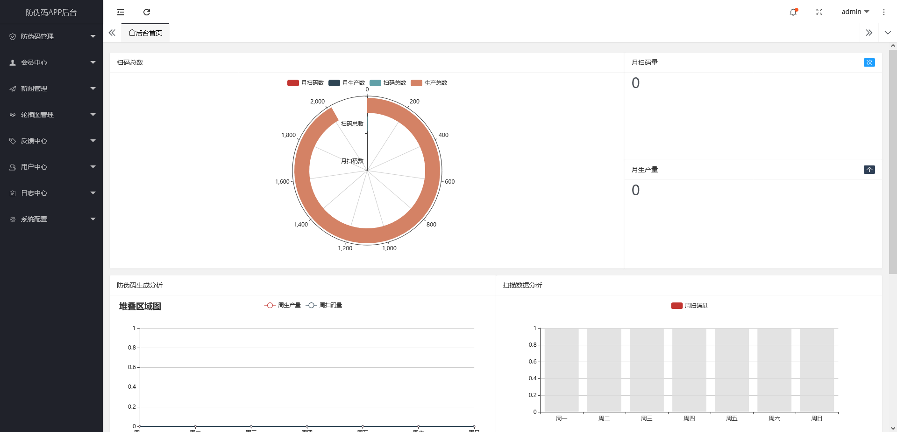
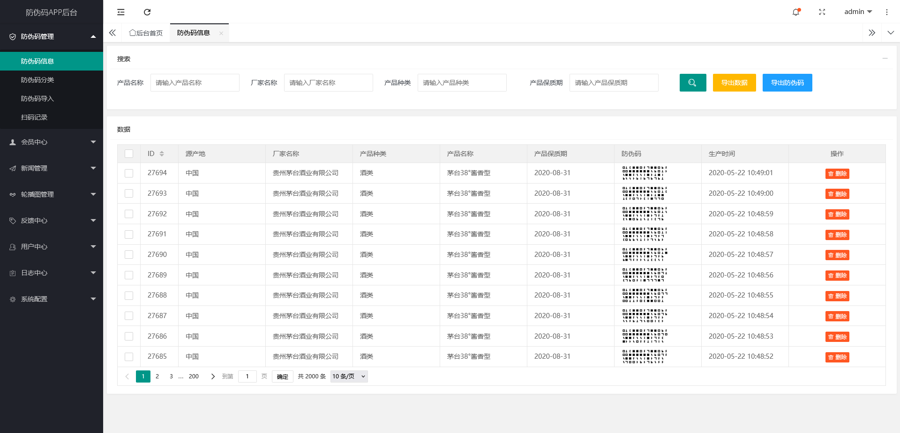
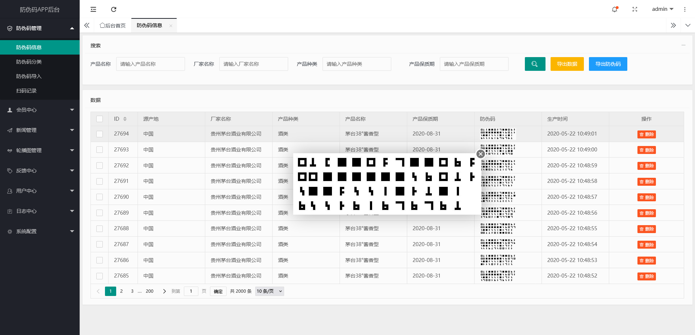
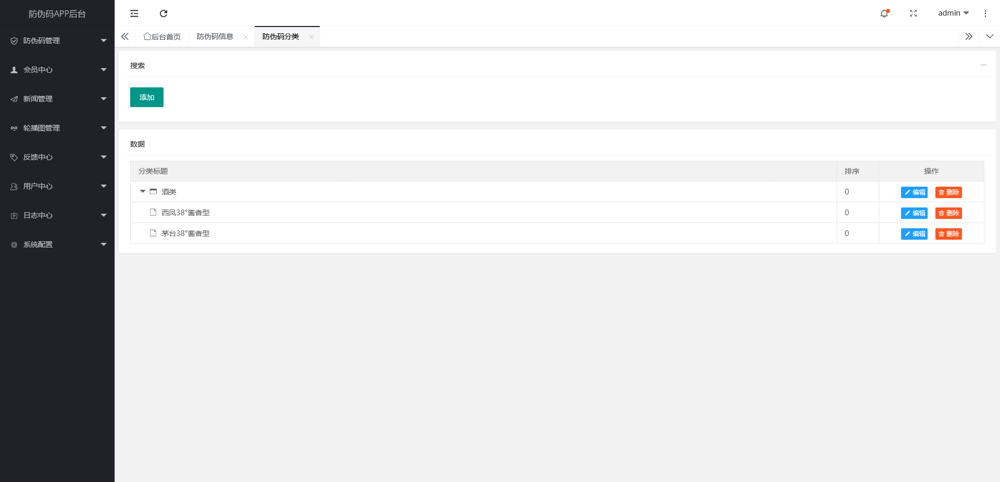
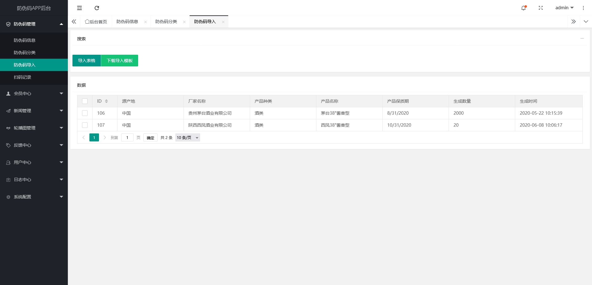
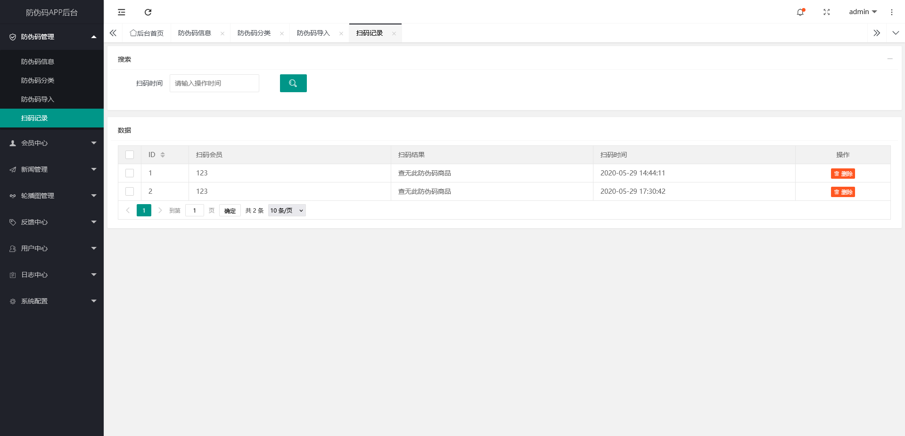

# 在线教育平台

现在有一些空闲时间，计划将2020年为一家职业学校定制化开发的在线教育平台进行重构。

## 技术使用

- 接口端使用：Laravel.
- 平台端使用：Vue3 + Vite
- 客户端使用：Uniapp

## 图片展示

[演示地址](https://develop.platform.xiechengfuwu.cn/)
admin
123456

## 商业合作
微信：zxf51115
